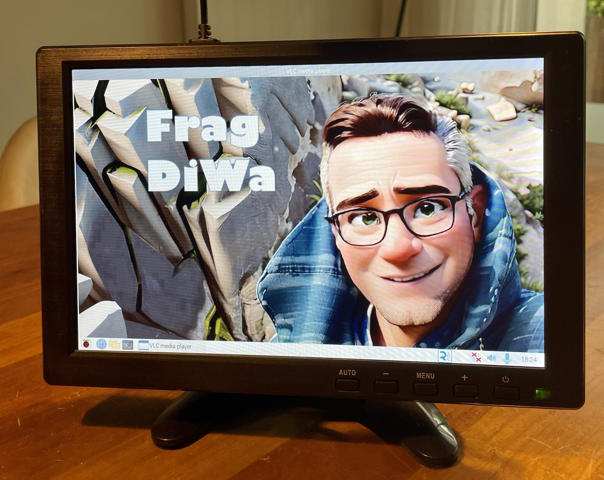

Maker Media GmbH

***

# Frag DiWa

## KI-Sprachassistent mit eigenem sprechendem Avatar

**Ein 10-Zoll-Display, ein Raspberry Pi und ein Mikrofon werden durch etwas Python-Code und viele Webdienste zu einem personalisierten Sprachassistenten, der zu allen Fragen eine (mehr oder weniger richtige) Antwort hat. Die Aufgaben und Fähigkeiten des eigenen Assistenten können je nach Bedarf im Python-Code auch noch erweitert werden.**



Hier gibt es den Code im Ordner [_src_](./src/) sowie weitere benötigte Dateien im Ordner [_misc_](./misc/). 

Wie im Artikel versprochen hier noch die Liste der benötigten Python-Bibliotheken für den Raspberry Pi für Copy & Paste:

````
pip3 install google-cloud-speech
pip3 install google-cloud-texttospeech
pip3 install python-vlc
pip3 install sounddevice
pip3 install pvrecorder
pip3 install pvporcupine
pip3 install picovoice
pip3 install python-dotenv
sudo apt-get install libportaudio2
````

Der vollständige Artikel zum Projekt steht in der **[Make-Ausgabe 7/23 ab Seite 80](https://www.heise.de/select/make/2023/7/2329207453222773039)**.